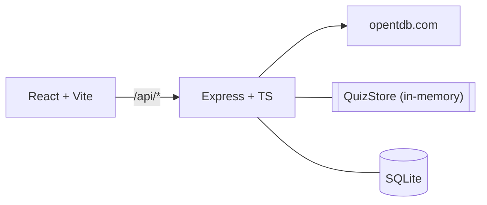

# Development & Architecture

## Overview

Quizzly is a trivia quiz web app backed by the Open Trivia Database.
Pick a topic and difficulty, answer one question at a time, see a
scored review, land on a persistent leaderboard.

The kata offered two stretch options: (a) user-created quizzes, or
(b) frontend features like timers, hints, or leaderboards. I picked
**leaderboard** — it exercises more of the stack (persistence,
filtering, ranking) than timers or hints would.

## Architecture



Three npm workspaces:

- **`shared/`** — API request/response types used by both sides.
  Contract change = compile error in both places.
- **`server/`** — Express + better-sqlite3. Proxies OpenTDB, holds
  active quizzes in memory, persists finished runs to SQLite.
- **`client/`** — React + Vite + react-router-dom. Pages: Home,
  Setup, Quiz, Results, Leaderboard.

### Request flow

1. Home calls `GET /api/categories` (cached server-side).
2. Setup posts `POST /api/quiz/start`. Server hits OpenTDB, decodes
   base64, shuffles options, stores `{ questionId → correctAnswer,
   options }` in `QuizStore`. Returns only shuffled options to the
   client.
3. Quiz shows one question at a time. sessionStorage mirrors answers
   on every selection so refresh doesn't lose progress.
4. Submit posts answers + player name. Server iterates its own stored
   map, scores, inserts to the leaderboard, drops the quiz.
5. Leaderboard pulls top 20 with category + difficulty filters.

## Key implementation decisions

### Correct answers never leave the server

`ClientQuestion` has no `correctAnswer` field. Scoring iterates the
stored map, not the submitted payload (`server/src/routes/quiz.ts`):

```ts
for (const [questionId, stored] of quiz.questions) {
  const submitted = body.answers.find(a => a.questionId === questionId);
  const submittedAnswer = submitted?.answer ?? '';
  const isCorrect = submittedAnswer === stored.correctAnswer;
}
```

Missing answers count as wrong. This also ruled out a `GET
/api/quiz/:id` rehydrate endpoint — any such endpoint is a potential
path to leak answers.

### Base64 decoding

OpenTDB responses use HTTP 200 for errors (real status lives in
`response_code`) and base64-encode every string field when
`encode=base64` is set — including the enum-shaped `type` and
`difficulty`. All fields are decoded uniformly; tests cover a
regression.

### Rank-in-slice SQL

Rank returned on insert = 1 + count of entries with strictly higher
percentage **in the same (category, difficulty) slice**. A perfect
Hard score doesn't deflate Easy ranks. NULL handling via the `IS`/`=`
pair (`server/src/db/leaderboard.ts`):

```sql
WHERE (category IS ? OR category = ?)
  AND (difficulty IS ? OR difficulty = ?)
  AND (score * 1.0 / total) > (? * 1.0 / ?)
```

### Refresh-resilient quiz

Router state dies on refresh. sessionStorage keyed by `quizId`
(`client/src/quizSession.ts`) restores the round without a backend
rehydrate endpoint.

## Testing

10 targeted tests in `server/tests/`:

- **OpenTDB client** (4): base64 decoding, code-5 rate-limit typed
  error, code-4 retry, category caching.
- **Leaderboard repo** (6): rank-in-slice, percentage-not-raw
  ordering, filter isolation, createdAt tie-break, server-computed
  percentage, rank 1 on empty board.

`:memory:` SQLite for isolation, `vi.stubGlobal('fetch', ...)` for
mocking. Happy path is also verified end-to-end against real OpenTDB.

## Project layout

```
shared/src/index.ts              API contract types

server/src/
  index.ts                       App wiring, DI, shutdown
  services/opentdb.ts            OpenTDB client
  services/quizStore.ts          In-memory active quizzes
  db/leaderboard.ts              SQLite repo
  db/schema.sql                  Schema
  routes/quiz.ts                 POST /start, POST /:id/submit
  routes/leaderboard.ts          GET /
  routes/categories.ts           GET /
server/tests/                    vitest (10 tests)

client/src/
  api.ts                         Typed fetch wrapper
  quizSession.ts                 sessionStorage helpers
  App.tsx, main.tsx, index.css
  pages/                         Home, Setup, Quiz, Results, Leaderboard
```
