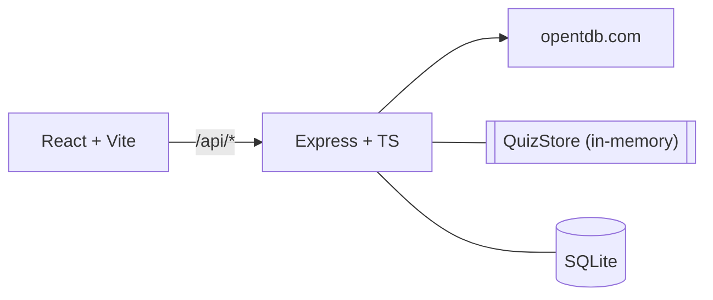

# Quizzly

Trivia quiz with a persistent leaderboard. Questions come from the
[Open Trivia Database](https://opentdb.com).

## Running it

Node 20+. `better-sqlite3` is a native module, so on macOS install
Xcode Command Line Tools (`xcode-select --install`) if `npm install`
fails with `gyp` errors.

```bash
npm install
npm run dev   # server :3001, client :5173
```

Open http://localhost:5173.

`npm test` runs 10 unit tests. `npm run typecheck` and `npm run build`
are also available.

## Architecture



- `shared/` — TypeScript API contract, imported by both sides.
- `server/` — Express proxy to OpenTDB, in-memory quiz store, SQLite repo.
- `client/` — React pages: Home, Setup, Quiz, Results, Leaderboard.

Vite proxies `/api/*` to `localhost:3001`.

## Key design decisions

- **Correct answers never leave the server.** `ClientQuestion` omits
  `correctAnswer`; scoring iterates the server's stored questions so
  missing answers count as wrong, not skipped.
- **Backend proxies OpenTDB.** Rate-limit protection, one decode path,
  and answers stay server-side.
- **Rank is computed per (category, difficulty) slice.** A perfect
  Hard score doesn't affect Easy-leaderboard ranks.
- **Shared types = single source of truth.** Contract changes fail
  compile on both sides.
- **Quiz state lives in sessionStorage.** Refresh-resilient without
  a backend rehydrate endpoint.

## Known limitations

- In-memory quiz store — single Node process only.
- Tab close mid-quiz ends the round.
- English only (OpenTDB).
- `dangerouslySetInnerHTML` on question text is safe because the
  source is OpenTDB; a real app with user-authored quizzes would
  need DOMPurify.

## Development & architecture

Full walkthrough in [PROCESS.md](./PROCESS.md). The flow is verified
end-to-end against the real OpenTDB API.
